# Design

## Components

Our infrastructure is composed of:

* ESP32 MCU 
* LoRa support for peer and cloud communication
* Water flow sensor
* Led & Buzzer
* Cloud system (AWS) to collect and store data

### ESP32

The ESP32 manages the different sensors and actuators in the infrastructure and exchanges messages with the other microcontrollers and with the cloud. The main technical issue is that the device will be attached to every object of interest and, apart from the source site, they should be battery powered. MCUs wakes up only when a test is needed, so we modulated a proper duty cicle in order to provide a longer battery lifetime. MCU at the source, instead, is connected to a power cord and does not have energy constraints, but a duty cycle is implemented as well.

### LoRa

LoRa is a physical radio communication protocol, based on spread spectrum modulation techniques derived from chirp spread spectrum (CSS) technology. The protocol is supported by our chosen ESP32 MCUs, allowing a low power and long range communication between microcontrollers in order to accomplish distributed tasks.

### Water flow sensors

Water flow sensors are installed at the water source or pipes to measure the flow rate of water. The chosen metric for flow measurement is liters per minute. The structure of the sensor consists of a valve (from which water can pass) and a water rotor along with a Hall effect sensor (a voltage difference is induced in the conductor due to the rotation of the rotor), measuring the sense and the intensity of the flow. When water flows through the valve, it causes a change of speed of the rotor, calculated as output as a pulse signal. The sensor is powered with a 5 V supply voltage of DC.

Water flow sensors used for our protoype can be found [here](https://www.amazon.it/dp/B079QYRQT5?psc=1&ref=ppx_yo2ov_dt_b_product_details)

### Led & Buzzer

A LED is used to provide a visual alarm indication through blinking. 
A buzzer is used to provide an acoustic alarm indication through intermitting activation.

### Cloud system

Data are stored on AWS for long term storage. Then these data can be displayed by farmers in order to gain insights about water usage, in detail the water flow at the source, and pipeline leakages, with the indication of detected location.

## How to detect a leakage

As a first step, we have to reason about our main requirement, leakage detection. In particular, we need to do a feasibility study about how to detect a leakage in a pipeline first, and then how to detect it in a distributed system. The following images show our reasoning process.    

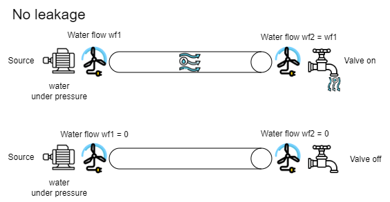
   
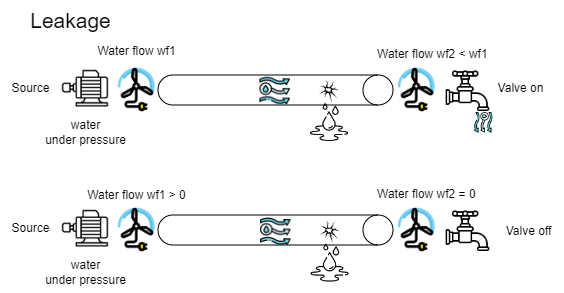
   
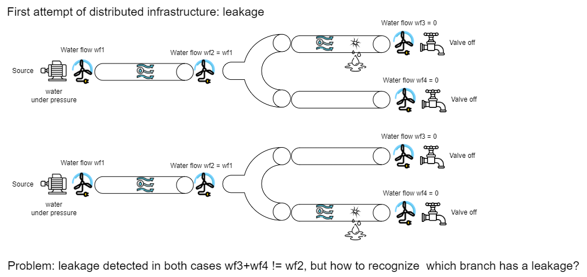
   
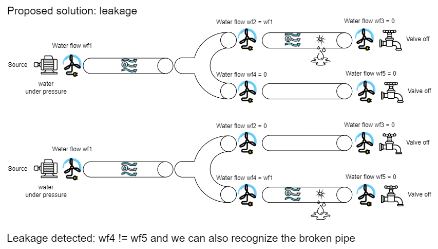
   

## Architecture

We propose a tree architecture with a MCU at source site connected to a water flow sensor, a LED and a buzzer. A fork is defined as a site where a single pipe divides itself in two or more output pipes. We place a water flow sensor for each of these diramations, all connected to a single MCU. So. a MCU at each fork site, which can be at different depth levels, is needed. Furthermore, we place a MCU for each pipeline branch, more precisely in correspondence of each irrigation valve, where we place a single water flow sensor connected to the MCU. Our architecture is scalable, so it can be used to control water leakages within a small field with the same crop or to control leakages from pipes irrigating different types of crop in the same field.  

Our system is composed of 3 different pieces:

* MCU near the water source (connected through a power cord) called CHIEF
* MCU near the pipeline fork (using a battery) called FORK
* MCU connected to a water flow sensor at valve site (using a battery) called BRANCH

Every node has an identificative number (in the case of the simulation given by IoT-Lab) and we designed a properly configuration function to extract the information for each node from the topology, given as father-child pairs.
Since in the simulation we used a node for each MCU, our tree architecture can be represented in a more understandable way as follows.  

In our architecture we preferred to focus our attention on things, with computation performed at nodes rather than in the cloud. So, the cloud only receives (from TTN) data about water flow and leakages that are simply displayed in the GUI. For some techical reasons explained in detail in the description of our simulation, we used a simple node communicating with TTN for demonstrating purposes. However, in the designed architecture each node receiving a flow from the father computes the difference between this flow and its own one and sends data to TTN.

## Prototype 
We construct a real prototype to demonstrate the working principle of the system. It is made up of a linear pipe and two MCUs located at its endopoints, with a water flow sensor for each one, together with a water source and an intermediate valve used to simulate a leakage.

Unfortunately, we found some problems working with LoRa with our chosen ESP32, even if it should be officially supported by RIOT. So, in order to overcome this issue, we decided to switch to WiFi technology only for demonstating purposes. The idea is that when LoRa issue will be hopefully solved soon our project can be adapted with minor changes. Even if we will not obiouvsly have the same performance of LoRa, the procedure of evaluation is identical.
For our prototype, we used the fllowing objects:

* A 1,5 meters long garden hose (20-25 mm ⌀)
* A 1/2 inch garden tap
* A 1/2 inch T-adapter
* 6 metal adjustable hose clamps (16-25 mm)
* 2 water flow sensors
* 2 ESP32 LoRa MCUs  

We started from a 1,5 meters long garden hose with an inner diameter of 20 mm and an outer one of 25 mm. We cut the garden hose into 4 main segments approximately 35 cm long. We placed two segments at the inner endpoints of each water flow sensor and we joined them using the T-adapter. So we connected the tap to the last free endpoint of the T-adapter and the last two segments to the outer endpoints of water flow sensor. We defined a direction for the flow placing the water flow sensors in the correct flow measurement direction. Finally, we connected the water flow sensors to the MCUs and the MCUs to a battery.
The tap is used to simulate a leakage and it is initially closed. We did not use clamps at first, but we experienced water leaks in correspondence of joints. Therefore we placed 2 clamps at the outer endpoints of each water flow sensor and other 2 for the endpoints of the T-adapter not connected to the tap. In this way we solved the problem of leakages at joints. The water flow sensor of father MCU and the water flow sensor of child MCU are 90cm apart.

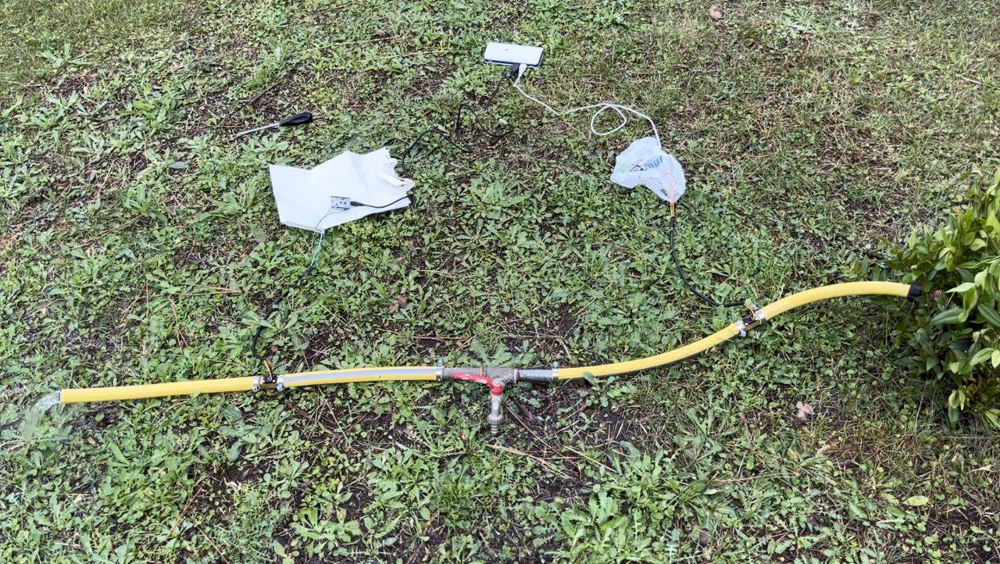

## Network architecture

The network architecture is focused on checking the actual state of the irrigation system, with a communication between devices based on LoRaWAN and MQTT.

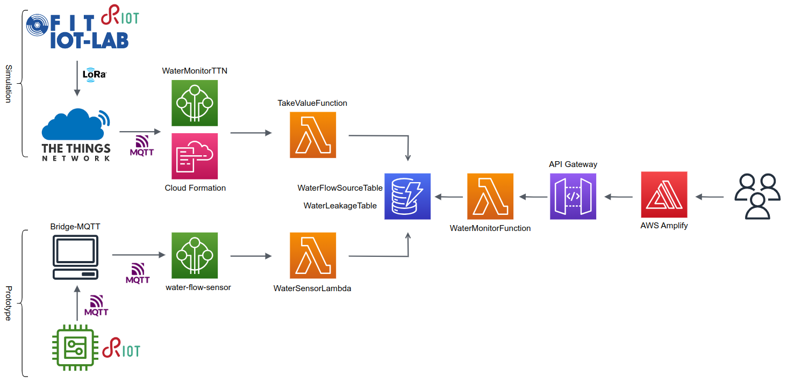
The AWS architecture above shows our cloud design. In detail, data are generated both from the prototype and the simulation, but sent to AWS through a MQTT-Bridge for the prototype and TTN for the simulation. Data are sent to AWS IoT Core, using also AWS CloudFormation in the case of TTN. With two proper AWS Lambda functions data are stored in two NoSQL DBs, one for the water flow at the source and one for water leakages. With a separate unique Lambda function, data are retrieved form DBs and associated to an API deployed with AWS API Gateway. The website frontend, taken data dynamically from API endpoint, has been deployed with AWS Amplify.

Here it is a demonstration of website content:

From the website user can monitor water flow at the source looking at last 10 measurements displayed in the upper graph and checking some statistics about average water flow. A proper alert is shown in case of leakage, with leakages displayed in the lower graph with correct location and quantity. Also here, some statistics can be retrieved.

## Algorithms

### Water leakage detection algorithm

In the following we describe the communication scheme between IoT elements, Edge components, and Cloud components, related to the algorithm for the leakage detection.

We analyse the water flow independently for each segment, intended as the pipe between two adjacent water flow sensors. Given a segment, we will call the node near the water source as 'parent' and the other one as 'child'.
Output water flows at fork site will be evaluated according to given paramters as pipe length or slope.

Test algorithm:

1. Node MCU sends water flow value to its children, if any.
2. If it is a FORK, child MCU computes expected values of water flow, by summing the values of its sensors.
3. Child MCU compares received value with its own value.
4. In case of leakage, child sends an alert to the cloud.

We have tried 3 different algorithms for allow a correct and synchronized test between two diffent nodes. The three algorthms are:

* Ack
* Handdshake
* SyncAck
All the algorithms are available in the directory "code-prototype"

#### Ack

This is the first algorithm that we have implemented and it does not work well. Firstly there is a bug in the code, in fact with this code the Son has an higher flow that the Source, and this is not physically possible (if you find the problem, please tell us where is it), Secondly with the data obtained, we have seen that the water flow arriving to the Source (before our architecture) is not stable and the code was not robust against this problem.

In particular the Source controls if there is a water flow, if yes it does the test and sends the value to the Son; the Son obtains the value, sends an "answr" to the Source (used to control the Son is not broken) and starts the test; after that it does the difference between the two values and see if there is a leakage or not, if yes it sends the value of the leakage in L/min to AWS.

For the motivation written before, this system is proned to the false positive and we have stopped the analysis on it.

#### Handshake

This is the second algorithm that we have implemented and it works well.

In particular the Source controls if there is a water flow, if yes it sends an "heloy" to the Son, the Son sends an "answr" to the Source, Source sends the message "start" and starts the test; when the Son obtains the "start" it also starts the test; the Source sends to the Son the result of the test and, when the Son has both the values, sees if there is a leakage, if yes it sends the value of the leakage in L/min to AWS.

This system works well but it is uselessly complex and it is less efficient than the next one.

#### SyncAck

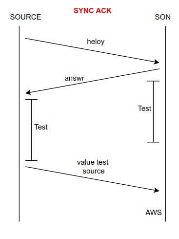

This is the third algorithm that we have implemented and it is the one that will be used in the real scenario.

In particular the Source controls if there is a water flow, if yes it sends an "heloy" to the Son, the Son sends an "answr" to the Source and it also starts the test, Source receives the message "answr" and starts the test; Source sends to the Son the result of the test; when the Son has both the values, sees if there is a leakage, if yes it sends the value of the leakage in L/min to AWS.

This system works well and uses one less message.

In the evaluetion part, it is available the different analysis on the data.

## Simulation

We built a simulation infrastructure on IoT-LAB, to provide a large-scale irrigation water leakage system and to test distributed interaction between MCUs. The communication between nodes is implemented using LoRaMAC, while LoRaWAN and TheThingsNetwork are used to send data to the cloud. Also, we will use this simulation to makes some experiments on energy consumpion using the IoT-LAB monitoring tool.

### Assumptions

The simulation aims to detect leakages in a scalable distributed infrastructure, while the prototype focus on detecting leakages for a single pipe. For this reason, in the simulation we have made some assumptions:

* A code function simulates samples to avoid delays in message propagation, false positives, and all the problems discussed in the prototype. Instead, we will use a logic time to simulate the sampling at the same time.
* Forks on a pipe will divide the water flow into equal parts.
* Since we are simulating samples, we can set the threshold for leakages to 0.

### Iot-Lab Architecture

As mentioned before, to build a scalable infrastucture we need to use three different types of nodes: CHIEF, FORK, and BRANCH. They can cover all the possible cases of a distributed infrastructure.
The minimal architecture of the system should be the following:

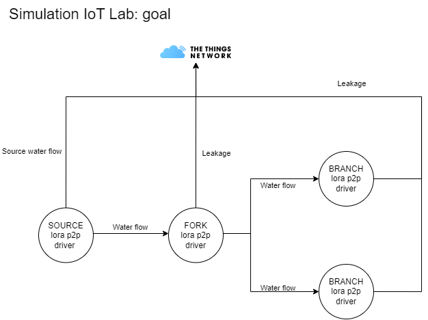

Node configuration

* Due to the fact that the firmware is distributed, we need to use the same firmware for all the nodes. For this reason, we need to build a configuration file named config.c that can be used for all the nodes, to understand which type of node is and who are its children.
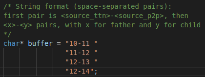
* After flashing the firmware we need to assign an ID to each node compliant with the configuration file.

Parameters

* Since requirements want to detect leakages in a day, we have decided to simulate a day in 60 seconds. Also, we have introduced a parameter called NUMBER_OF_SENDING_PER_DAY that represents the number of samples sent by the node in a day, in order to implement the duty cycle. For the simplicity of the demo, we have set this parameter to 3 but the value for the real application it is discussed in the Evaluation page.

Sample generator

* The sample generator is a function that simulates the sampling of the water flow. Its aim is also to test the various leakage scenario discussed in the 'How to detect a leakge' paragraph.

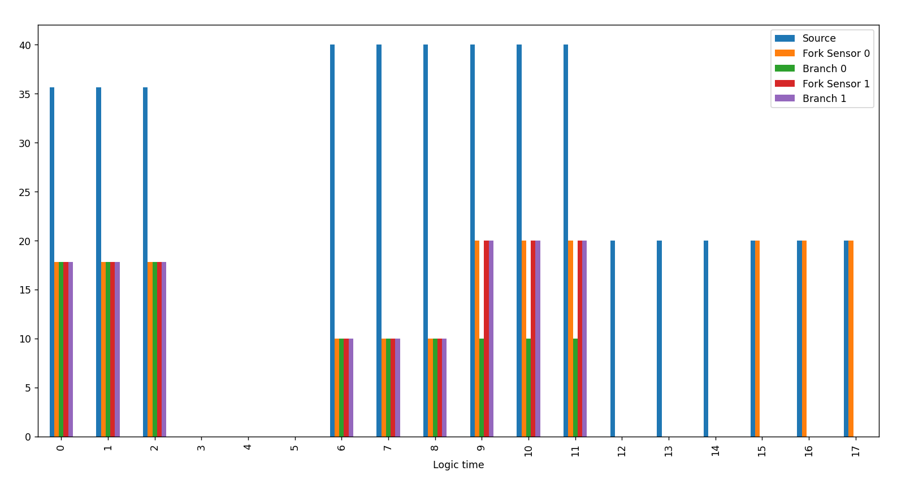

* logic_time in [0, 2]: Simulate no LEAKAGE with water usage - Test also float water flow mesurements
* logic_time in [3, 5]: Simulate no LEAKAGE without water usage
* logic_time in [6, 8]: Simulate a LEAKAGE between the CHIEF and the FORK with water usage
* logic_time in [9, 11]: Simulate a LEAKAGE between the FORK and a BRANCH with water usage
* logic_time in [12, 14]: Simulate a LEAKAGE between the CHIEF and the FORK without water usage
* logic_time in [15, 17]: Simulate a LEAKAGE between the FORK and a BRANCH without water usage

Comunication protocols

* The nodes communicate with each other using RIOT-OS Semtech SX127x radios drivers implementation, sending asynchronous messages containing the water flow value.
* Each node sends leakage messages to The Things Network (TTN) using a RIOT adaption of Semtech LoRaMAC implementation.

But, during the implementation we have found some difficulties on integrating the Semtech LoRaMAC implementation with the RIOT-OS Semtech SX127x radios drivers implementation. In particular, initialising both the drivers on the same node, causes some conflicts that invalidate the communication of both node-TTN ans node-to-node.
For this reason we have decided to use another node to connect our infrastructure to TTN, and in order to be able to send leakage messages generated by the nodes using LoRaMAC, we have decided to pick these leakage information directly from the sample generator since building a UART communication between the nodes requires time that can be used to solve our initial problem i.e. the conflicts between the LoRa drivers.

So, our implementation is the following:

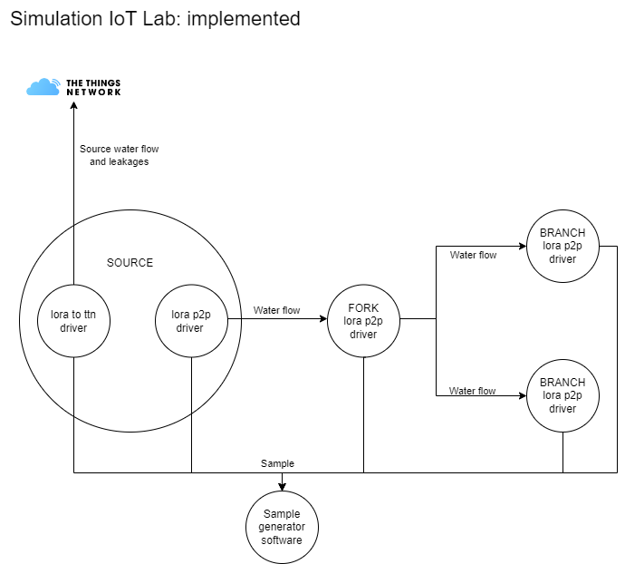

Messages

* Semtech SX127x radios drivers implementation allows to send messages of at most 32 bytes in broadcast mode. This implies that a node in the listen mode can receive messages from all the nodes in the range. For this reason, we have decided to use a message structure that contains the following information:

  * The app id: 0000
  * The id of sender node
  * The id of receiver node
  * A flag that indicates if the message is a value
  * The value of the water flow
  * The logic time

* When a node receives a message, it checks if the message is sent by our infrustructure and if the message is directed to it.
* We have observed that RIOT SX127x drivers fails to handle messages with a payload higher than 32 bytes which causes a stack overflow and the crash of the node. That's a critical problem because messages sent by external nodes can cause the crash of our infrastructure.

Radio

* The radio can't be used to send a message and listen at the same time. Then, with a certain probability that increases with the number of sending messages per day, during the message transmission, incoming messages can be lost.

### Open Issues

* Integration of lora sx127x drivers for p2p communication and loramac for ttn communication.
* Using real samples instead of simulated ones.
* Crash of the node when receiving messages with a payload higher than 32 bytes.
