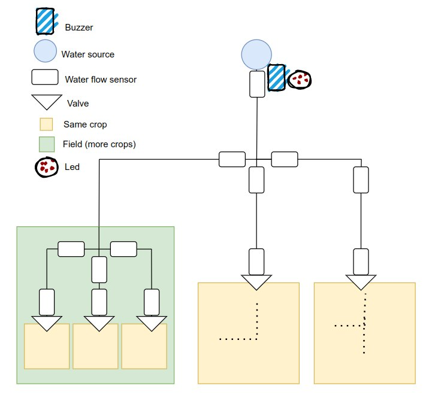
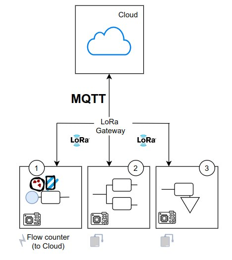
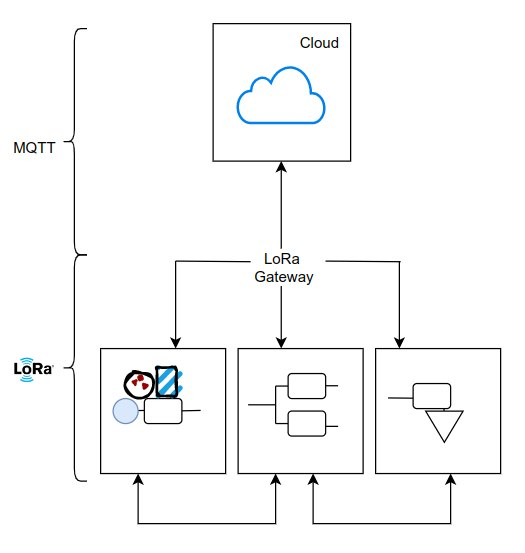

# Design

## Architecture

We propose a tree architecture with a MCU at source site connected to a water flow sensor, a LED and a buzzer. A fork is defined as a site where a single pipe divides itself in two or more output pipes. We place a water flow sensor for each of these diramations, all connected to a single MCU. So. a MCU at each fork site, which can be at different depth levels, is needed. Furthermore, we place a MCU for each pipeline branch, more precisely in correspondence of each irrigation valve, where we place a single water flow sensor connected to the MCU. Our architecture is scalable, so it can be used to control water leakages within a small field with the same crop or to control leakages from pipes irrigating different types of crop in the same field.  

Since in the simulation we used a node for each MCU, our tree architecture can be represented in a more understandable way as follows.

## High level diagram

Our system is composed of 3 different pieces:

* MCU near the water source (connected through a power cord) called CHIEF
* MCU near the pipeline fork (using a battery) called FORK, with an ID for the fork and a NUMBER for each branch water flow sensor
* MCU connected to a water flow sensor at valve site (using a battery) called BRANCH and with a NUMBER (consistent with the NUMBER value in the relative FORK)

## Components

Our infrastructure is composed of:

* ESP32 MCU with LoRa support for peer and cloud communication
* Water flow sensor
* LED
* Buzzer
* Cloud system (AWS) to collect and store data

### ESP32

The ESP32 manages the different sensors and actuators in the infrastructure and exchanges messages with the other microcontrollers and with the cloud. The main technical issue is that the device will be attached to every object of interest and thus should be battery powered:

* CHIEF is connected to a power cord and does not have energy problems
* FORK and BRANCH wakes up only when a test is needed, so we modulated a proper duty cicle in order to provide a longer battery lifetime

### LoRa

LoRa is a physical radio communication protocol, based on spread spectrum modulation techniques derived from chirp spread spectrum (CSS) technology. The protocol is supported by our chosen ESP32 MCUs, allowing a low power and long range communication between microcontrollers in order to accomplish distributed tasks.

### Sensors

#### Water flow sensors

Water flow sensors are installed at the water source or pipes to measure the flow rate of water. The relative metric is as liters per hour or cubic meters, to be scaled in our context. The structure of the sensor consists of a plastic valve (from which water can pass) and a water rotor along with a Hall effect sensor (a voltage difference is induced in the conductor due to the rotation of the rotor), measuring the sense and the intensity of the flow. When water flows through the valve, it causes a change of speed of the rotor, calculated as output as a pulse signal. The sensor is powered with a 5 V supply voltage of DC.

You can find our water flow sensor [here](https://www.amazon.it/dp/B079QYRQT5?psc=1&ref=ppx_yo2ov_dt_b_product_details)

### Actuators

#### LED

A LED is used to provide a visual alarm indication through blinking.

#### Buzzer

A buzzer is used to provide an acoustic alarm indication through intermitting activation.

### Cloud system

Data are stored on AWS for long term storage. These data can then be queried by farmers in order to gain insights about water usage and pipeline leakages.

## Prototype architecture

For our prototype, we used the fllowing objects:

* A 1,5 meters long garden hose (20-25 mm ⌀)
* A 1/2 inch garden tap
* A 1/2 inch T-adapter
* 6 metal adjustable hose clamps (16-25 mm)
* 2 water flow sensors
* 2 ESP32 LoRa MCUs  

We started from a 1,5 meters long garden hose with an inner diameter of 20 mm and an outer one of 25 mm. We cut the garden hose into 4 main segments approximately 35 cm long and a smaller one around 10 cm long. We placed two segments at the endpoints of each water flow sensor and we joined them using the T-adapter. We connected the tap to the last free endpoint of the T-adapter and the smallest pipe segment to the tap dispenser. So we connected the water flow sensors to the MCUs.
The tap is used to simulate a leakage and it is initially closed. We did not use clamps at first, but we experienced water leaks in correspondence of joints. Therefore we placed 2 clamps at the endpoints of each water flow sensor and other 2 for the endpoints of the T-adapter not connected to the tap.

The final protoype architecture is the following.

## Network architecture

The network architecture is focused on checking the actual state of the irrigation system, with a communication between devices based on LoRaWAN and MQTT. We will also make some considerations about the scalability of different possible network schemes.

## Algorithms

### Water leakage detection algorithm

This is the communication scheme between IoT elements, Edge components, and Cloud components, related to the algorithm for the leakage detection.

We analyse the water flow for each segment, intended as the pipe between two adjacent water flow sensors. Output water flows at fork site will be evaluated according to given paramters as pipe length or slope.

Algorithm idea (CHIEF duty cycle):

(DUE_TEST is set to true every 24 hours, NO_TEST is initialized to 0)

1. If flag DUE_TEST is set or NO_TEST is set, CHIEF checks if there is water flow (regular water usage monitoring).
2. If there is a water flow, it starts the test and sets the flags to 0.
3. If there is not a water flow, it sets NO_TEST.

Test algorithm:

1. Node MCU sends water flow value to its children.
2. If it is a FORK, child MCU computes expected values of water flow
3. Child MCU compares received value with its own value.
4. In case of error, child sends an alert to the cloud.

We have tried 3 different algorithms for allow a correct and synchronized test between two diffent nodes. The three algorthms are:

* Ack
* Handdshake
* SyncAck
All the algorithms are available in the directory "code-prototype".

#### Ack

This is the first algorithm that we have implemented and it does not work well. Firstly there is a bug in the code, in fact with this code the Son has an higher flow that the Source, and this is not physically possible (if you find the problem, please tell us where is it), Secondly with the data obtained, we have seen that the water flow arriving to the Source (before our architecture) is not stable and the code was not robust against this problem.

In particular the Source controls if there is a water flow, if yes it does the test and sends the value to the Son; the Son obtains the value, sends an "answr" to the Source (used to control the Son is not broken) and starts the test; after that it does the difference between the two values and see if there is a leakage or not, if yes it sends the value of the leakage in L/min to AWS.

For the motivation written before, this system is proned to the false positive and we have stopped the analysis on it. 

#### Handshake

This is the second algorithm that we have implemented and it works well.

In particular the Source controls if there is a water flow, if yes it sends an "heloy" to the Son, the Son sends an "answr" to the Source, Source sends the message "start" and starts the test; when the Son obtains the "start" it also starts the test; the Source sends to the Son the result of the test and, when the Son has both the values, sees if there is a leakage, if yes it sends the value of the leakage in L/min to AWS.

This system works well but it is uselessly complex and it is less efficient than the next one.

#### SyncAck

This is the third algorithm that we have implemented and it is the one that will be used in the real scenario.

In particular the Source controls if there is a water flow, if yes it sends an "heloy" to the Son, the Son sends an "answr" to the Source and it also starts the test, Source receives the message "answr" and starts the test; Source sends to the Son the result of the test; when the Son has both the values, sees if there is a leakage, if yes it sends the value of the leakage in L/min to AWS.

This system works well and uses one less message.

In the evaluetion part, it is available the different analysis on the data.
