# Evaluation

## Evaluation methodology: Overall System

As a general performance evaluation of the system, we wanted to detect if a water leak occurs within 24 hours, in order to detect water leakages without tolerating more than one day of water losses. We wanted also to know wich pipe is leaking.

We used the following metrics to evaluate the performance of the system:

1. Leak is dectected within 24 hours
2. The pipe is correctly identified

## Evaluation methodology: Individual Components

We wish to evaluate the power consumption of MCUs that are not attached to a power cord, so for the FORK and the BRANCH MCUs.

+ Power supply of source site MCU is provided by a power cord, hence there are no specific constraints on power consumption.
+ MCUs at fork sites and crop site, due to the limited workload, we wish to obtain a battery life equal to the total period of irrigation.

## Algorithms Performances

### Water leak detection Algorithm Problems

Before designing a water leak detection algorithm, we focused on the dynamics of water in pipes. Since we are dealing with an irrigation system, a reasonable assumption is to consider **water in pipes under pressure**. It means that there are never empty pipes. Now, we can have two conditions, either stationary water or moving water, due to the increasing pressure at the source during irrigation time. This means that we can ignore the specific condition when doing a test, because the difference between adjacent flows will be bounded in both cases if there is no leakage, and not bounded otherwise. The detection algorithm starts from the source and propagates through the tree topology, always with the same logic for every father-child pair. The father sends water flow information to the child, which makes a proper computation and compares the obtained value with the received one, using a specific threshold. In case of leakage detection, it will communicate the leakage to the cloud through the LoRa gateway.

One of the main problems related to the test is related to synchronization, because of the delay related to transmission latency. We thought about an handshaking approach to take into account this discrepancy and to compare water flows starting the sampling process at two close moments.

1. Test propagation phase
2. Leak notification

The complexity will change depending on the number of FORKs, we have choose the topology of the Design.

The three algorithms proposed in the design phase have been tested. 

The test of the Ack algorithm has shown that there is a problem in the code (intially we thought it is caused by the use of threads in the program, after we understood is linked to the water flow sensor) and that the water flow before our system (that we consider always present) is not stable and this issue has to be solved by the synchronization algorithm. 

The problem of stability of the initial water flow can be seen in the following image in which there is a segmentation of the lines of the graph. 

  
About the Ack algorithm, it is possible to notice that it is good to detect a leakage but it says that the water flow of the Son is always higher than the water flow of the Source, and this can lead to error, so it is not the worst algorithm implemented. 

The following image shows the test of the ack algorithm and it is possible to observ the big difference between Source and Son. 
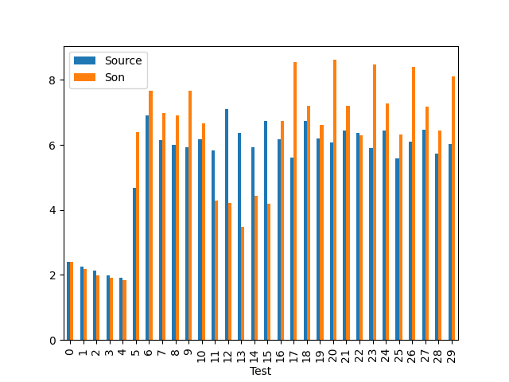 

About the Hanshake algorithm, it is perfect to detect the leakage and the trend of the Son higher than the Source is disappeared. There still is an error of the turbines, that we will face in the next chapter. 

The following image shows the test of the Handshake algorithm and it is possible to observ a smaller difference between Source and Son. But there still is a trend in which the Son is higher than the Source. 
 

In the end, about the syncAck algorithm, it is possible to see the same trend of the handshake algorithm but with one less message. There is also here the error of the turbines. 

The following image shows the test of the SyncAck algorithm and it is possible to observ a smaller difference between Source and Son. Here the trend is that the Source is higher than the Son. 
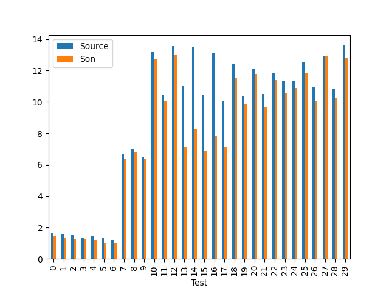 

### Water leak detection Algorithm Solutions

After several tests, and using the considerations done before, we have found that one water flow sensor has some problems and detect less impulses. 

Not having other sensors, we have decided to put the best sensor in the Source and the worst in the Son, so we will have an higher Source in a NO leakage situation.

### Water leak detection Threshold

We have done some analysis to set a correct threshold in our algorithms to limit the presence of false positives and false negatives. 

We have chosen the syncAck as the final algorithm because it uses one message less.
We have analysed the time of the SyncAck algorithm to understand the error that can be created and to use this values for the calucus of the energy consumption.
We have analysed that the standard deviation is high and this means that there is a large distribution of the data, in particular this means that the time taken by the messages and the code is fluctuating. Looking at the scheme, it is possible to understand the time of the messages and also the quality of the synchronization of the algorithms. 
 
Here the messages take 0.462 s while the latency of the two samplings is 0.552 s (time in the Son between the end of the test and the arrival of the value of the Source). This means that the Source has ended the test 0.090s before the Son. We double it (also for the difference in starting time) and we obtain 0.180s. 

 **Difference** 
To find the error of the algorithm we have to decide the time of testing: now is 3s but if we increase it, the influence of the error derived by the synchronization problem is less.The proportion is 0.180 : TimeSampling = x : 100. The FlowMax is 30 l/min.

With influence we mean: **$FlowMax \cdot \frac{0.180 \cdot 100}{TimeSampling}$**:

We have analysed three times of testing. 
* TimeSampling of 3s: 6% of influence, 1.8 L/min difference of water
* TimeSampling of 5s: 3.6% of influence 1.08 L/min difference of water
* TimeSampling of 10s: 1.8% of influence 0.54 L/min difference of water

So we take 10s of sampling time to limit the possible error. We do not increase more the sampling time because there will be a trade off with the energy.

Now it is important to discuss this values. The 0.54 L/min is the possible difference of L/min between the Source and the Son, if, when the Source ends the sampling, the water flow goes directly to zero. This is the worst case scenario but it is important to analyse the algoritmic error in the worst case.  

It is important to focus also on the instrumental error.

In the last days, we have also analysed the time of the handshake algorithm. We have not take the time, but we have done an interesting observation.

Because the Source starts before the testing, the water has to flow on the pipeline and arrives after in the second turbine. So if the water is slower than the time of latency, the water of the first turbine not taken by the sampling of the Source arrives after the end of the sampling of the Son. It is important to analyse the speed of the water and the time from the Source to the Son. In particular:  
* diameter of pipeline: 0.015m
* area of circle: 0.00018 $m^{2}$
* water flow of water max (worst case): 30 L/min = 0.5 L/s
* distance: 0.9 m

$$speed of water=  \frac{0.5 \cdot 10^{-3}}{0.00018} = 2.83 \frac{m}{s}$$

$$time =  \frac{2.83}{0.9} = 0.32 s$$

This is valid for 0.9 m. Teoreticallu, increasing the distance between the two turbines, there will be an higher time and so the observation still holds. It is needed to do test with higher distance to see if this still holds and if the relationship is linear.

With this observation, the algorithmic error is not significant, we can approssimate it to zero.

In conclusion, the handshake algorithmic error is almost zero and better than the SyncAck algorithmic error.  
But, because we have done this observation lately, at this point we have choose the **SyncAck algorithm** because it uses one message less. We will see after that the handshake algorithm is not too much more consuming than the SyncAck.  
Then we have choose a **sampling time of 10 seconds** to have a longer analysis of the environment, but this is unrelated with the algorithmin error.

### Turbine error

Another significant error of the architecture is the instrumental error of the water flow sensor. Because of we have not another turbine with the correct value of the water flow or other instruments, we have run the system for several tests and we have analysed the difference between the values of Source and Son. We have observed the difference because the water flow before our application is not costant (decided by the public pipeline). It is important to observ that this error is influenced by the algorithmic error too. We have taken in consideration also the handshake algorithm.

The following image shows the test of the Handshake algorithm with the best water flow sensor in the Son.
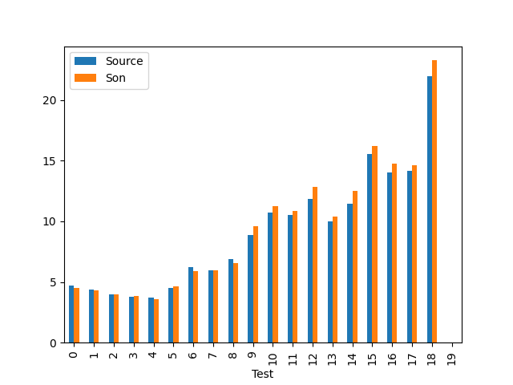 

The following image shows the test of the Handshake algorithm with the best water flow sensor in the Source.
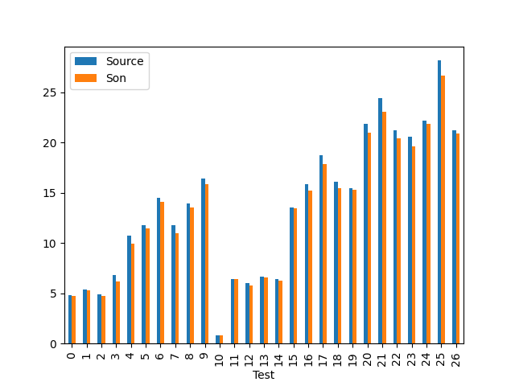 

The following image shows the test of the SyncAck algorithm with the best water flow sensor in the Son.
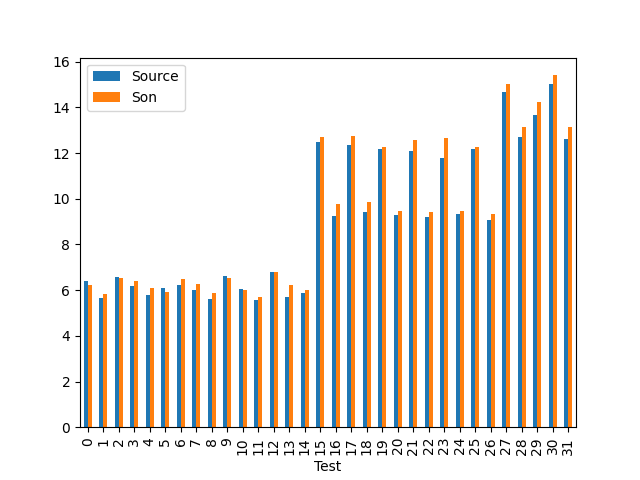 

The following image shows the test of the SyncAck algorithm with the best water flow sensor in the Source.
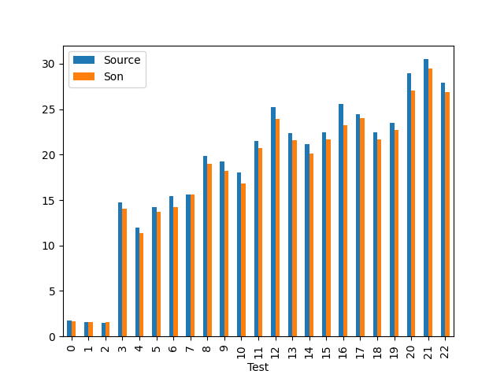 

The system is proned to have the Son with an higher water flow value, if you put turbine A before turbine B, but this happens because the turbine A is less efficient.  
For our prototype and with a distance of 90cm between the nodes, based on the consideration of the several approssimations, We have initially fought to put a threshold of 1 L/min, but then we have done more considerations. 
We have first set a fixed scenario: 
* turbine B = Source 
* turbine A = Son
Then, we have done a lot of tests changing time of sampling and water flow rate.  
With the analysis of the algorithmic error done before, we thought that an higher sampling was more accurate but the data has not shown this. The tests are done with the use of the syncAck, the table below shows the error rate for the different situation:  

|flow x time| 3s | 5s | 9s |
|--- |--- |--- |--- |
| 0-30 L/min | 0.84 L/min | 0.49 L/min | 0.74 L/min |
| 0-10 L/min | 0.14 L/min | 0.29 L/min | 0.13 L/min |
| 10-20 L/min | 0.58 L/min | 0.67 L/min | 0.76 L/min |
| 20-30 L/min | 1.11 L/min | 1.16 L/min | 1.10 L/min |

The first line is not relevant because there are not enough data and are not distributed well. 
Then, it is possible to note that the difference is not caused by the different time of sampling, but by the different water flow rate: this lead to say that the main error is the error of the turbines and not the error of the algorithm.  
So, we can decide to use the syncAck algorithm knowing that it uses one message less, not keeping in mind the algorithmic error.  

 
We have analysed these data to fix a threshold for the detection of the leakages, and we have done the mean of **(flowSource-flowSon)x100/flowSource** %:

* 3s -> 4,29%
* 5s -> 6,34%
* 9s (done 9s and not 10s because of a problem of MQTT) -> 4,30%  

We have decide to take 10s for the sampling and this will be similar to 9s result, so in this situation we can put a fixed threshold of > 2L/min or dynamic threshold flowSource-flowSon > 5% flowSource L/min. The dynamic threshold is more efficient because it is more accurate in the lower water flow rate. We have done some sperimental test but the system was proned to false positives. So below there are our conclusions.

#### Conclusions on the threshold

Finally, for the threshold, we will give this observation:
1. We did some tests and considering the average, we observed that in a No leakage situation there is a 5% difference between Source and Son, due to the error of a turbine (instrumental error).
2. We then observed that, based on the changes in the flow before the source (therefore on the stability of the flow rate of the pipeline), there may be an average possible error of 1.8%, due to the algorithmic error.
3. We have observed that in the handshake this algorithmic error is teoretical less, but for time constraints we have not focus on it.
4. We have tried to apply the 5% threshold but experimentally we found too many false positives. We tried 7% and 10%. We have judged that 10% is acceptable.
5. Finally considering that the turbines in a NO leakage situation have an unexpected 5% error; assuming that there is not the same problem for the future system, we will have a threshold of 5%.
6. Why did it happen? 
* First of all we have done many approximations.
* The standard deviation is high and we have understood it as an unreliability of the mean. 
* Finally, the conduct of the test affects the result: the position of the cell phone and the turbines varies the times of the messages (and therefore the algorithmic error).
* The stability of water flow rate before the Source has been probably good during the training of the threshold and bad in the test.

### Energy consumption

#### Duty cycle

Our requirement is not to tolerate a water loss of more than one day, so we wish to detect a leakage within 24 hours. Now, since the leakage is an unpredictable event, we cannot define a precise strategy apriori, but we want to indentify the best one in order to minimize power consumption. We compute this strategy analitically. In the first following analysis, we do not make any assumption about synchronization of nodes. Firstly, for simplicity, we focus on a simple father-child pair, since the same reasoning holds for every adjacent pair of nodes of the tree topology. Now, we define x as the send rate (msg/day) of the father, so the number of messages sent per day, and y as the total listen interval of the child (in hours/day). 

In order to be sure to correctly listen to at least one message in one day, y should be equal to (24/x + epsilon) hours/day, where epsilon is a neglectable time interval if compared with 24/x hours. Computing the energy consumption, there are three contributions, one related to the sender, one to the receiver and one to the exchange of messages linked to the leakage detection algorithm, so both for synchronization and test. This last component can be omitted in our considerations because it is not relevant for our estimation of x, which we wish to know. So, the energy consumption to minimize is given by:

$$E(x,y) = E(x) + E(y) + E(algorithm) \approx E(x) + E(y)$$

The two components are: 
$$E(x) = (P_{trans} \cdot t_{trans}) \cdot x + (P_{on} \cdot t_{on}) \cdot x +(P_{off} \cdot t_{off}) \cdot x$$

$$E(y) = P_{listen} \cdot y + P_{on} \cdot t_{on} + P_{off} \cdot t_{off}$$

Our analysis is hence focused on finding the integer value of x (number of messages per day of the father) such that the energy consumption is minimized. The listen time of the child will depends on x value. 

In order to estimate the value of x to minimize energy consumption, we analysed some graphs from IoT-Lab simulation.
First, we considered the transmission parameters of LoRa:

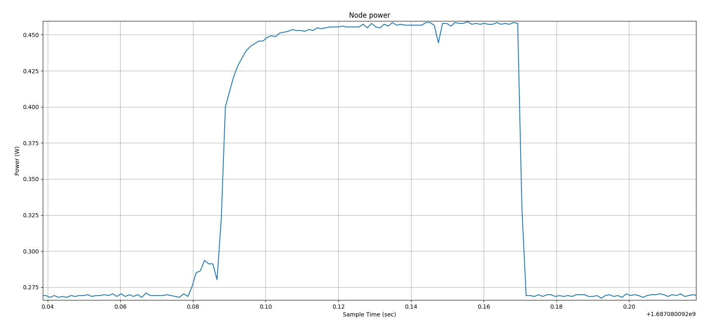

The transmission time and power are:
$$P_{trans} = 0.455 W$$ 
$$t_{trans} = (0.17 - 0.080) s = 0.090 s = 2.5 \cdot 10^{-5} h$$

The effective transmission effectively starts at 0.085 seconds, however, we considered all the interval time where some variation is revealed. In this way we also considered the contribution of the energy for switching on and off the transmission. Hence:

$$E(x) = (P_{trans} \cdot t_{trans}) \cdot x + (P_{on} \cdot t_{on}) \cdot x +(P_{off} \cdot t_{off}) \cdot x$$
$$E(x) \approx (P_{trans} \cdot t_{trans}) \cdot x = (0.455 W) \cdot (2.5 \cdot 10^{-5} h) \cdot x = 1.14 \cdot 10^{-5} Wh \cdot x$$

The power consumption due to listening can be found analysing the listening process:

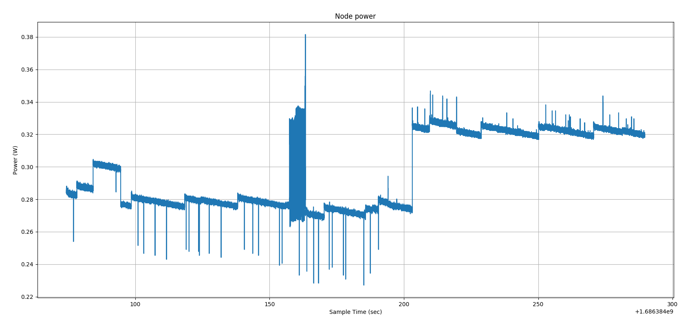

So the average listening power is:

$$P_{listen} = 0.325 W$$

While the average sleeping power, useful for further considerations, is:

$$P_{sleep} = 0.28 W$$

Also, for this case, we do not consider the small constributions due to the a single on and a single off switching, so:

$$E(y) = P_{listen} \cdot y + P_{on} \cdot t_{on} + P_{off} \cdot t_{off}$$
$$E(y) \approx P_{listen} \cdot y $$

So, the final analysis is on the function:

$$E(x) + E(y) = 1.14 \cdot 10^{-5} \cdot x + (0.325 \cdot \frac{24}{x}) $$

So the function to minimize is:

$$f(x) = 1.14 \cdot 10^{-5} \cdot x + \frac{7.8}{x}$$

The minimum of the function, considering the domain of $$x \geq 1$$
because we have to send at least one message per day. Solving the function analytically, we found a global minimum for:

$$x \approx 828$$

So the send rate of the father should be 10 messages/day, hence the listen time will be:

$$y = \frac{24}{x} = \frac{24}{828} \approx 0.029 \frac{hours}{day} \approx 1.74 \frac{min}{day} \approx 104 \frac{s}{day}$$

#### Estimation of system duration

To analyse the duration of our system, we must also consider other energy contributions, mainly the measurement, the sleep and the cloud transmission energy consumptions. We considered the daily worst case, so the case of an intermediate node that measures twice and sends data to child 1300 times, listens for 1 minute, receives data from the father once after algorithm execution and sends once to the cloud the difference with father water flow. In our analysis,

$$E_{cloud} \approx E_{trans} = 1.14 \cdot 10^{-5} Wh$$

The energy of measurement has been computed from the prototype, since water flow values are simply simulated and not measured in IoT-Lab simulation. Hence:

$$E_{measure} = (P_{sensor} + P_{active}) * t_{sampling} = [(0.05W) + (0.28 W)] \cdot (10 s) = (0.33 W) \cdot (2.78 * 10^{-3}) = 9.174 \cdot 10^{-4} Wh$$

Daily energy consumption is computed as:

$$E_{tot} = 2 \cdot E_{measure} + E_{trans}\cdot 828 + 2 \cdot E_{trans} + E_{cloud} + P_{listen} \cdot (0.029h) + P_{sleep} \cdot (24 - 0.029) h$$

$$E_{tot} = 2 \cdot (9.174 \cdot 10^{-4} Wh) + (1.14 \cdot 10^{-5} Wh) \cdot 828 + 3 \cdot (1.14 \cdot 10^{-5} Wh) + (0.325 W) \cdot (0.029 h) + (0.28 W) \cdot (23.971 h)$$
$$E_{tot} \approx (1.835 \cdot 10^{-3} Wh) + (9.47 \cdot 10^{-3} Wh) + (9.425 \cdot 10^{-3} Wh) + (6.71 Wh) \approx 6.73 Wh $$

So, for a year:

$$E_{tot} = E_{tot} \cdot 365 = 2456.71 Wh$$

Here, we have used the power of the sleep monitored from Iot-Lab and indeed the consumption is huge, but in the datasheet of our [Heltec ESP32 Lora v2](https://heltec.org/project/wifi-lora-32/) it is reported the power consumption of the Deep Sleep Mode:
$$P_{deepSleep} \approx 800µA \cdot 5V =  0.004 W $$
$$E_{tot} \approx (1.835 \cdot 10^{-3} Wh) + (9.47 \cdot 10^{-3} Wh) + (9.425 \cdot 10^{-3} Wh) + (0.096 Wh) \approx 0.117 Wh $$

So, for a year:

$$E_{tot} = E_{tot} \cdot 365 = 42.61 Wh$$

Also here the consumption is too huge, because the time of listening is too high. So we propose another approach.

### Drift rate clock

Starting from the output of the chapter before, we use another approach with node synchronization. We have observed that for these environments, battery of 1000-2000 mAh are used.

The listening time is reduced, in particular we have to synchronize the nodes in pairs and for each node there will be a situation in which it will be the passive one (waiting in listening) and another situation in which it will be active (send the message for starting the test). As before, we consider the worst case, in which a node is both passive and active. We use Deep sleep mode. The drift rate for ESP32 is 1.7 sec per day. Assuming a resynchronization for each day, we need to set a listening time per day such that the drift rate over the day is not a problem. An acceptable solution is 10 seconds/day.

$$E_{tot} = 2 \cdot E_{measure} + E_{trans}\cdot 1 + 2 \cdot E_{trans} + E_{cloud} + P_{listen} \cdot (2.76 \cdot 10^{-3}h) + P_{deepSleep} \cdot (23.99) h$$

$$E_{tot} = 2 \cdot (9.174 \cdot 10^{-4} Wh) + (1.14 \cdot 10^{-5} Wh) \cdot 1 + 3 \cdot (1.14 \cdot 10^{-5} Wh) + (0.325 W) \cdot (2.76 \cdot 10^{-3}h) + (0.004 W) \cdot (23.99 h)$$
$$E_{tot} \approx (1.835 \cdot 10^{-3} Wh) + (4.56 \cdot 10^{-5} Wh) + (8.97 \cdot 10^{-4} Wh) + (0.096 Wh) \approx 0.099 Wh $$

So, for a year:

$$E_{tot} = E_{tot} \cdot 365 \approx 36 Wh$$

In this situation, we would use a $5000mAh$ battery (for example, a phone battery), replacing it every 6 months

So, we noticed that the energy consumption bottleneck is given by the energy consumed during sleep time. However, in the official documentation of [ESP32 Series](https://www.espressif.com/sites/default/files/documentation/esp32_datasheet_en.pdf), we found another value for the Deep sleep mode:

$$P_{deepSleep} \approx 150µA \cdot 5V =  0.00075 W $$
$$E_{tot} \approx (1.835 \cdot 10^{-3} Wh) + (4.56 \cdot 10^{-5} Wh) + (8.97 \cdot 10^{-4} Wh) + (0.018 Wh) \approx 0.021 Wh $$
So, for a year:

$$E_{tot} = E_{tot} \cdot 365 = 7.58 Wh$$

Now, with a battery of $2500 mAh$, we can power the device for at least one year, that is our user requirement.

### Water flow sensor for energy harvesting

Our water flow sensor can not create energy for our batteries because the electronic part is not connected to the turbine, it is only connected to the Hall Effect sensor.

To allow energy harvesting, we should have an alternator connected to the turbine to transform the mechanical energy into electrical energy.

A possible solution for the energy harvesting can be found [here](https://www.ebay.it/itm/322724692568) with the [tutorial](https://www.youtube.com/watch?v=mtMO3VmCmiQ) of the turbine.

We should for example connect this type of turbine called micro hydro water turbine generator to our water flow sensor.
  

We have analysed if there is the possibility to charge the device using this turbine and it is feasible: 
1. From previous analysis, ESP32 and water flow sensor are powered with $0.33 W$. 

2. The Micro Water Turbine Hydro Generator works at 12 V and gives a power of $10 W$. Since the diameter is lower than the diameter of the Water Flow Sensor, we do a proportion: if the sensor works with max 30 L/min (diameter=15,24mm), the generator work with max 25,6 L/min (diameter=13mm). 
The generator ideally can charge the device and the sensor beacuse it gives $10 W$ and needed power is $0.33 W$. Other analysis should be done to know the daily water flow and relative energy produced. 

For this situation, the problem is different, indeed the question is what is the water flow rate on average. Answering this question it is possible to understand if the system can be survive with the turbine generator or not. A interesting observation is that, cause of the fact that the system will be huge, the nodes near to the Source will have an higher water flow rate and so more energy, while the Son in the tail of the pipeline will have some energy in relationship to the crop. Cause of this fact, the complete harvesting of the energy depends on the crops of the environment.

### Simulation energy consumption experiments

In order to understand better the monitoring profile of IoT-Lab, we have done some experiments:

+ As a first exeriment we have launched an experiment without flashing the firmware to understand the minimum energy consumption of the node.

+ Then we have flashed the firmware and we have launched an experiment with an empty main, and we observe a single peek of energy consumption.

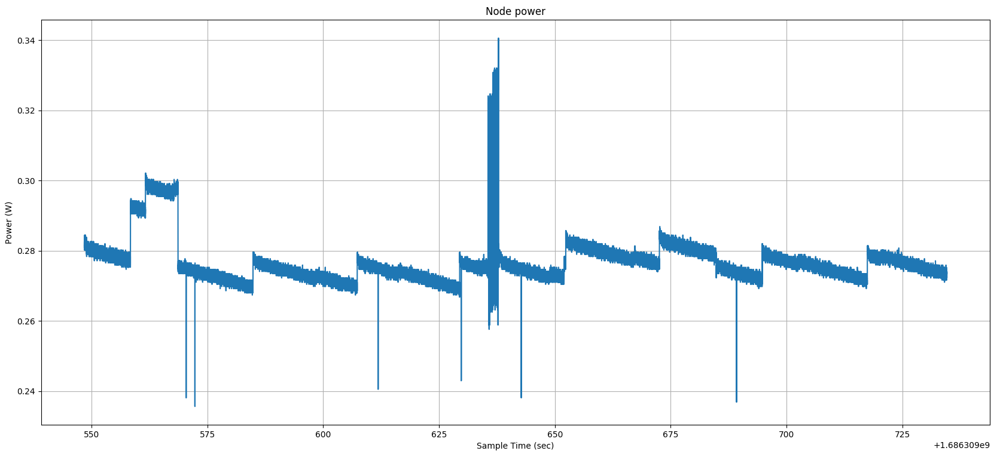

+ After that, we have questioned about the consumption of the sleep mode, so we have launched an experiment with a main that only sleep for 300 seconds and then we have observed the consumption of the sleep mode. We have observed that the sleep mode is like the no flash firmware graph.

-example.png)

+ We say in the above section the energy consumption of LoRa listening and transmitting.

+ Finally we have put all together and we have launched an experiment implementing a duty cycle for all the three node types (CHIEF, FORK and BRANCH).

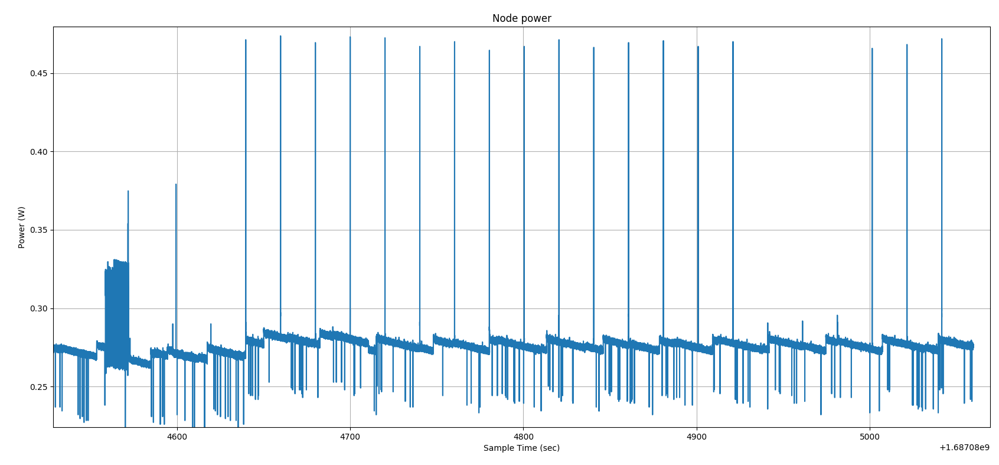   
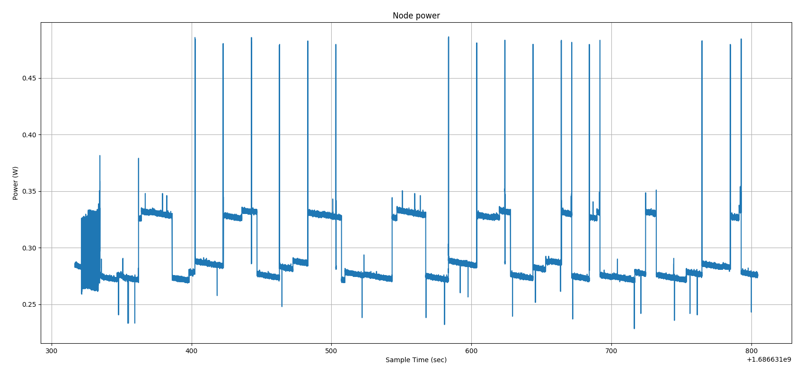   
   
